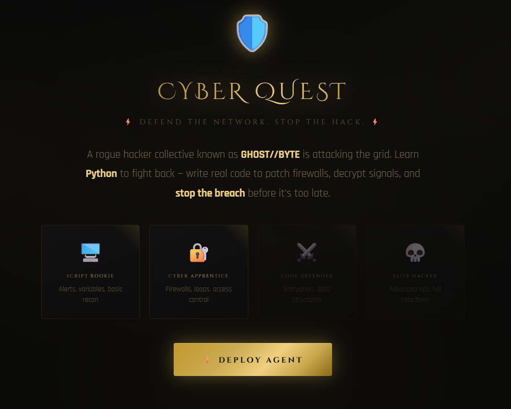

# 🛡️ Cyber Quest — Defend the Network

> **Learn Python by stopping a hack.** An interactive, browser-based coding game where every challenge is a real mission to protect the grid from the GHOST//BYTE collective.

   

---

## 📖 Overview

Cyber Quest is a **zero-dependency, single-file HTML game** that teaches Python fundamentals through a cybersecurity narrative. Players take on the role of a newly recruited security analyst tasked with stopping a rogue hacker collective from breaching the network. Each mission teaches a Python concept — variables, loops, functions, data structures — disguised as a real defensive operation.

No installation. No server. No frameworks. Open `cyber-quest.html` in any modern browser and play.


---

## 🎮 Gameplay

Each mission has two phases:

- **📡 Briefing** — A narrative sets the scene, an intel report explains the Python concept, and the mission objective is outlined
- **💻 Mission** — The player writes or answers code directly in the browser to complete the objective

There are three mission types:

| Type | Description |
|---|---|
| **Code** | Write Python in a live editor and press RUN to execute |
| **Multiple Choice** | Select the correct answer from four options |
| **Fill in the Blank** | Type the missing keyword to complete a line of code |

---

## 🗺️ Sectors & Missions

The game spans **5 Sectors** with **17 missions** of increasing difficulty.

### Sector 1 — Boot Camp
Fundamentals of Python syntax and data types.

| # | Mission | Concept | Type |
|---|---|---|---|
| 1 | Broadcast the Alert! | `print()` | Code |
| 2 | Secure the Intel | Variables | Code |
| 3 | Crack the Access Code | Order of operations | MCQ |
| 4 | Forge the Credentials | String concatenation | Code |
| 5 | Read the Security Flag | Booleans / data types | MCQ |

### Sector 2 — Firewall Protocol
Decision-making and repetition in code.

| # | Mission | Concept | Type |
|---|---|---|---|
| 6 | Set the Access Gate | `if` statements | Code |
| 7 | Two-Factor Authorization | `if / else` | Code |
| 8 | Scan the Ports | `for` loops | Code |
| 9 | Threat Monitor Loop | `while` keyword | Fill Blank |

### Sector 3 — Encryption Division
Building reusable tools with functions.

| # | Mission | Concept | Type |
|---|---|---|---|
| 10 | Deploy Encryption Protocol | Defining functions | Code |
| 11 | Personalized Threat Alert | Function parameters | Code |
| 12 | Exfiltrate the Data | `return` keyword | MCQ |

### Sector 4 — Data Vault
Working with Python's core data structures.

| # | Mission | Concept | Type |
|---|---|---|---|
| 13 | Build the Blocklist | Lists | Code |
| 14 | Sweep the Blocklist | Looping over lists | Code |
| 15 | Register the Operative | Dictionaries | Code |

### Sector 5 — The Final Hack
Putting it all together under pressure.

| # | Mission | Concept | Type |
|---|---|---|---|
| 16 | Patch the Firewall! | Debugging (3 bugs) | Code |
| 17 | The GHOST//BYTE Takedown | Functions + loops + return | Code |

---

## ⚙️ Game Systems

### XP & Levels
Players earn XP for completing missions. Accumulating enough XP triggers a level-up with a full-screen promotion ceremony.

| Level | Rank | XP Required |
|---|---|---|
| 1 | Script Rookie | 0 |
| 2 | Cyber Apprentice | 100 |
| 3 | Code Defender | 250 |
| 4 | Security Engineer | 450 |
| 5 | Elite Hacker | 700 |

### Streak System
Correct answers in a row build a streak, tracked in the HUD. The best streak is saved to the agent profile.

### Badges
Nine unlockable badges reward milestones across the game.

| Badge | Condition |
|---|---|
| 🎯 First Blood | Complete your first mission |
| 🔥 On Fire | 3 correct answers in a row |
| ⚡ Unstoppable | 5 correct answers in a row |
| 🔐 Clearance Level 2 | Reach Level 2 |
| 🛡️ Clearance Level 3 | Reach Level 3 |
| 🖥️ Boot Camp Clear | Complete all of Sector 1 |
| 🔒 Firewall Online | Complete all of Sector 2 |
| 🐛 Bug Exterminator | Fix the corrupted firewall (Mission 16) |
| 💀 Elite Hacker | Complete all 17 missions |

### Save System
Progress is automatically saved to `localStorage` after every mission. Returning players see their current level, XP, completion percentage, and last played date on the welcome screen, with a **Resume Mission** button that picks up exactly where they left off.

### Hint System
Every mission has a hint button. Hints are hidden by default and revealed on demand, so players are encouraged to try first.

### Sound Engine
All sound effects are generated programmatically via the **Web Audio API** — no audio files required. Sounds can be toggled on/off from the HUD at any time.

---

## 🖥️ Python Interpreter

Cyber Quest includes a custom **in-browser Python-to-JavaScript transpiler** that supports:

- `print()` with string concatenation
- Variables, arithmetic, and order of operations
- `if`, `elif`, `else` statements
- `for` loops with `range()` and list iteration
- `while` loops
- Function definitions with `def`, parameters, and `return`
- Lists with index access
- Dictionaries with key access
- `len()`, `True`, `False`, `None`
- Indentation-to-brace conversion

> **Note:** The interpreter is intentionally scoped to the concepts taught in the game. It is not a full Python runtime.

---

## 🚀 Getting Started

No installation, build step, or internet connection required (after the initial load of Google Fonts).

```bash
# Clone the repo
git clone https://github.com/your-username/cyber-quest.git

# Open the game
open cyber-quest.html
```

Or simply download `cyber-quest.html` and open it in any modern browser.

**Compatible with:** Chrome, Firefox, Safari, Edge (any version from the last 4 years)

---

## 📁 Project Structure

```
cyber-quest/
└── cyber-quest.html    # The entire game — HTML, CSS, JS, and data in one file
└── README.md           # This file
```

Everything — styles, game logic, challenge data, the Python transpiler, the sound engine, and the save system — lives in a single self-contained HTML file with no external dependencies beyond Google Fonts.

---

## 🎨 Design

The visual theme is **Clubroom Contrast** — deep ink-black backgrounds with metallic gold accents inspired by high-end print design. Key design choices:

- **Multi-stop metallic gold gradients** applied to text, buttons, and borders to simulate foil
- **Cinzel Decorative** serif for headings — authoritative and dramatic
- **Share Tech Mono** monospace for all code and data — technical and clean
- **Rajdhani** sans-serif for body text — modern and readable at small sizes
- Razor-thin `1px` gold borders with inset highlights to create depth without noise
- Ambient radial glows on the background to give the black canvas warmth

---

## 🛠️ Customisation

The challenge data is a plain JavaScript array at the top of the script block. Adding a new mission is straightforward:

```js
{
  id: 18,
  world: 'Advanced Ops',
  worldNum: 6,
  emoji: '🧬',
  title: 'Your Mission Title',
  difficulty: 'HARD',   // EASY | MEDIUM | HARD | EXPERT
  xp: 80,
  type: 'code',         // code | mcq | fillblank
  story: 'Narrative briefing shown to the player.',
  lesson: 'Concept explanation shown in the Briefing tab.',
  code_example: `# Example code shown in the lesson`,
  task: 'What the player must do.',
  starter: `# Starter code shown in the editor\n`,
  check: (out) => out.trim() === 'Expected output',
  hint: 'Hint shown when player asks for help.',
  successMsg: 'Message shown on correct answer.',
  failMsg: 'Message shown on wrong answer.'
}
```

---

## 📄 License

MIT — free to use, modify, and distribute.

---

*Built with vanilla HTML, CSS, and JavaScript. No frameworks. No build tools. No dependencies.*
